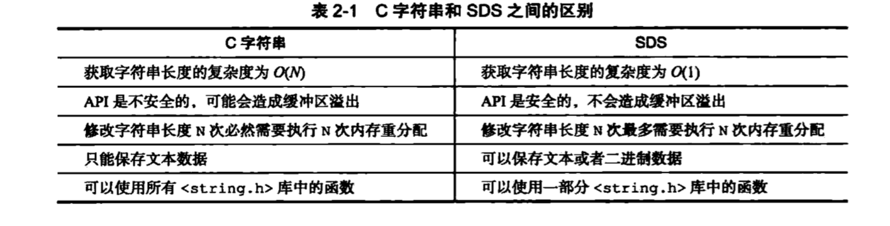

# Redis设计与实现--简单动态字符串SDS

## 简单动态字符串（simple dynamic String， SDS）
*SDS定义

```c
struct sdshdr {
    //buf已使用的长度，也就是字符串的长度
    int len;
    //buf未使用的长度
    int free;
    //保存字符串，以/0结尾，不计入字符串长度中
    char buf[];
}
```

* Redis中，C字符串只会作为字符串字面量用在一些无需对字符串值进行修改的地方。Redis自己构建了SDS作为Redis的默认支付穿表示，让Redis需要一个可以被修改的字符串值时，就会使用SDS，比如在Redis数据库里，包含字符串的键值对。由于Redis会频繁修改数据，所以不能用C字符串，因为C字符串每一修改空间长度（增加或缩小）都需要频繁重新分配内存，在Redis中会对性能造成影响。SDS通过预留空间（free）来避免这个问题。
* SDS与C字符串的区别
    - 常数复杂度获取字符串长度：SDS自身保存了字符串长度，而C字符串没有，C字符串要获取长度只能遍历，复杂度为O(N)。
    - 杜绝缓冲区溢出：C字符串拼接字符串可能会导致字符串长度溢出，使得其他的的字符串被修改。SDS拼接前会检查空间大小，如果不够会自动扩展空间。
    - C字符串以/0作为结尾，因此他只能存储文本数据，不能存储图片、语音等。而SDS以len来判断结尾，因此可保存任何类型的数据。
    - SDS兼容部分C字符串函数，SDS遵循以/0结尾的惯例，是为了在保存文本数据时能够复用<string.h>库定义的函数。
* 减小修改字符串时到来的内存重新分配
    - 空间预分配：用于优化SDS的字符串增长操作，分配空间之后，会给SDS分配与总长度相同的未使用空间（如果len值小于1M），如果len大于1M，就只给free分配1M。如果没有分配空间，free不会变大。通过预分配的方式，SDS将连续增长N次所需的内存分配次数从必定N次降为了最多N次
    - 惰性空间释放：用于优化SDS的字符串缩短操作。当缩短SDS字符串时，不会立即重新分配内存来回收多出来的空间，而是用free属性来将这些字节的数量记录出来，并等待将来使用。SDS提供了相应的API，让我们在有需要时，真正的释放SDS的未使用空间。
* 总结：


