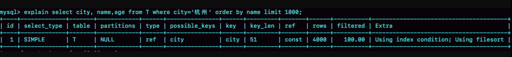
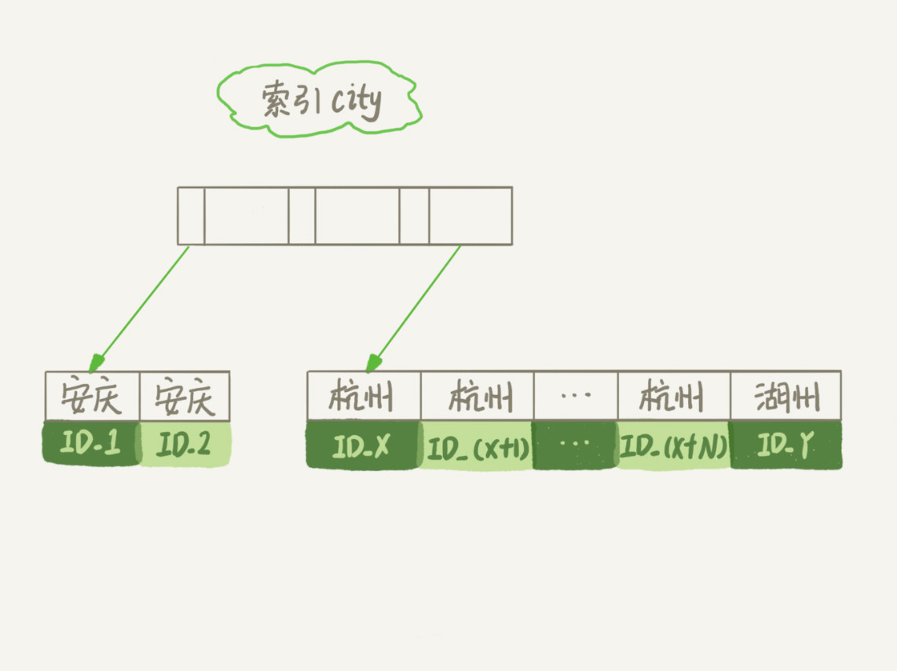

# 极客时间--MySQL实战45讲--第16讲："order by是怎么工作的"

    select city,name,age from t where city="杭州" order by name limit 1000;
&emsp;&emsp;其中主键是id，city是索引    
执行explain命令，结果如下：

&emsp;&emsp;extra这个字段中的"using filesort"表示的就是需要排序，MySQL会给每个线程分配一块内存用于排序，称为sort_buffer

&emsp;&emsp;这个sql的执行流程如下：
1. 初始化sort_buffer，确定放入name、city、age这三个字段
2. 从索引city找到第一个满足city=‘杭州’条件的主键id，也就是ID_X
3. 从主键中取出整行，取出name、city、age三个字段的值，放入sort_buffer中
4. 从索引city取出下一个记录的主键id；
5. 重复3、4步，直到查到city的值不满足条件为止，也就是图中的ID_Y
6. 对sort_buffer中的数据按照name做快速排序
7. 取出排序结果的前1000行返回给客户端

[全字段排序过程](../images/mysql实战45讲/全字段排序过程.jpg)

&emsp;&emsp;排序的过程可能在内存中，也可能在磁盘临时文件中，这取决于sort_buffer_size，就是MySQL为排序开辟的内存大小，如果小于这个内存，就在内存中排序，否则就在临时文件中排序（归并排序）
* rowid排序
&emsp;&emsp;如果单行太大，内存里能放入的行就太少，要分成很多个临时文件，排序性能会很差，这时MySQL会换一个算法。
&emsp;&emsp;新的算法放入sort_buffer的字段，只有要排序的列(name字段)和主键ID。这时流程就变了：
1. 初始化sort_buffer,确定放入两个字段
2. 从索引city找到第一个满足city='杭州'条件的主键ID
3. 到主键ID索引中取出整个行，取出name、id这两个字段放入sort_buffer
4. 从索引city取下一个记录的主键id
5. 对sort_buffer中的数据按照name字段进行排序
6. 遍历排序结果，取出前1000行，按照id的值返回原表中取出city、name、age这三个字段返回给客户端

[rowid排序](../images/mysql实战45讲/rowid排序.jpg)

* 然而上面的方式都需要用到排序，如果name字段本身就是有序的，那就不需要多余的排序的。因此可改变索引

        alter table t add index city_user(city, name);
这样索引的示意图：[city和name的联合索引示意图](../images/mysql实战45讲/city和name的联合索引示意图.jpg)
这样流程就变成了：
1. 从索引(city,name)找到第一个满足city条件的主键id
2. 到主键id索引取出整行，取出name、city、age三个字段，作为结果集的一部分直接返回
3. 从索引（city，name）取出下一个记录主键id
4. 重复2、3，之道查到1000行记录，或者不满足city=“杭州”条件的时候结束循环
[city和nam联合索引的执行计划](../images/mysql实战45讲/city和nam联合索引的执行计划.jpg)

* 上面的查询过程还是会回表查询，更进一步，可是使用覆盖索引来避免回表查询。构建索引：

        alter table t add index city_user_age(city, name, age);
查询流程就变成了：
1. 从索引(city,name,age)找到第一个满足条件city=“杭州”条件的记录，取出city、name、age字段，作为结果集的一部分返回
2. 从索引取出下一个记录，取出这三个字段返回
3. 重复2、3步骤，之道查到1000条记录，或者不满足city="杭州"条件循环就结束
[city和name和age联合索引后的执行计划](../images/mysql实战45讲/city和name和age联合索引后的执行计划.jpg)
