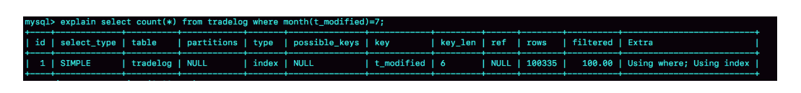

# 极客时间--MySQL实战45讲--第18讲：为什么这些SQL语句逻辑相同，性能缺差异巨大

### 案例一：条件字段函数操作

有一个交易表

    mysql> CREATE TABLE `tradelog` (
    `id` int(11) NOT NULL,
    `tradeid` varchar(32) DEFAULT NULL,
    `operator` int(11) DEFAULT NULL,
    `t_modified` datetime DEFAULT NULL,
    PRIMARY KEY (`id`),
    KEY `tradeid` (`tradeid`),
    KEY `t_modified` (`t_modified`)
    ) ENGINE=InnoDB DEFAULT CHARSET=utf8mb4;

需要统计所有年份里发生在7月份的交易量，sql是这样的：

    mysql> select count(*) from tradelog where month(t_modified)=7;

虽然t_modified上有索引，然而执行速度却很慢。**因为对字段用了函数操作，会破坏索引值的顺序性，因此优化器决定放弃走树搜索功能** 。需要注意的是，优化器并不是要放弃使用这个索引，在这个例子中，放弃了树搜索的功能 。优化器通过对比索引大小后发现，t_modified比主键主键索引更小，遍历这个所有比遍历主键索引来的更快。因此最终还是会选择索引t_modified

执行结果如下：

可以改写成：
    mysql> select count(*) from tradelog where
    -> (t_modified >= '2016-7-1' and t_modified<'2016-8-1') or
    -> (t_modified >= '2017-7-1' and t_modified<'2017-8-1') or
    -> (t_modified >= '2018-7-1' and t_modified<'2018-8-1');
### 案例二：隐式类型转换
    mysql> select * from tradelog where tradeid=110717;
&emsp;&emsp;tradeid有索引，但这条语句走的是全表扫描。因为他的字段类型是VARCHAR(32)，而输入的类型却是整形，所以需要转型
上面这个语句相当于：

    mysql> select * from tradelog where  CAST(tradid AS signed int) = 110717;
这用到了第一条的规则，对索引字段做函数操作，优化器会放弃走索引
### 案例三：隐式字符编码转换
&emsp;&emsp;如果两个表的字符集不同，在进行关联操作时，可能会进行字符集类型的转换，会用到第一个规则，导致不能走索引。
    mysql> select d.* from tradelog l, trade_detail d where d.tradeid=l.tradeid and l.id=2;
上面这个语句，trade_detail表的tradeid是一个索引。但这两个表，一个是uft8语句字符集，一个是utf8mb4，当这两个类型在做比较的时候，会把utf8字符串转换成utf8mb4字符集。这与带个规则相同，同样不能走索引
