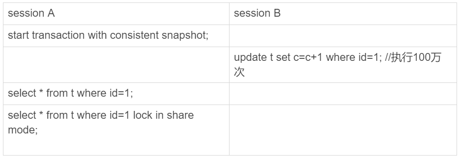

# 极客时间--MySQL实战45讲--第19讲：为什么我只查一行数据，也执行的那么慢

&emsp;&emsp;假设有这么一个表，里面有10万行记录

    mysql> CREATE TABLE `t` (
      `id` int(11) NOT NULL,
      `c` int(11) DEFAULT NULL,
      PRIMARY KEY (`id`)
    ) ENGINE=InnoDB;

    delimiter ;;
    create procedure idata()
    begin
      declare i int;
      set i=1;
      while(i<=100000)do
        insert into t values(i,i)
        set i=i+1;
      end while;
    end;;
    delimiter ;

    call idata();
### 第一类：查询长时间不能返回
    select * from t where id = 1;
* 等MDL锁，示意图：

解决方式是找到谁持有了MDL写锁，把他kill掉

* 等flush

        mysql> select * from information_schema.processlist where id=1;

&emsp;&emsp;

这个状态表示，现在有个线程正要对表t做flush操作，用法如下:
    flush tables t with read lock;//关闭表t
    flush tables with read lock;//关闭所有表

* 等待行锁

    mysql> select * from t where id=1 lock in share mode;

如果这时有线程持有了写锁，这个查询语句就会被阻塞住，方法是查到谁占了写锁，kill掉，被kil掉时，会自动回滚这个连接里面正在执行的线程：

    mysql> select * from t sys.innodb_lock_waits where locked_table=`'test'.'t'`\G
### 第二类：查询慢    

    mysql> select * from t where id=1；
这条语句只扫描一行，但是执行的很慢，大概花了800毫秒
另一条语句：
    select * from t where id = 1 lock in share mode;
这条语句加了锁，理应更慢，却只花了0.2毫秒

复现过程如下：

&emsp;&emsp;lock in share mode的语句是当前读，因此会直接返回1000001，速度很快。而select * from t where id = 1，是一致性读，需要从1000001开始，依次执行undo log，执行了100万次，才将结果1返回，所以速度很慢

