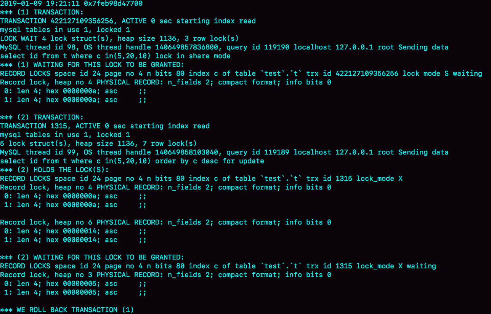

# 极客时间--MySQL实战45讲--第30讲：用动态的观点看加锁

**加锁规则**
* 原则1：加锁的基本单位是next-key lock，前开后闭
* 原则2：查找过程中访问到的对象才会加锁
* 优化1：索引上的等值查询，给唯一索引加锁的时候，next-key lock退化为行锁
* 优化2：索引上的等值查询，向右遍历时且最后一个值不满足查询条件的时候，next-key lock退化为间隙锁
* 一个bug：唯一索引上的范围查询会访问到不满足条件的第一个值为止

对下面这张表进行讨论：

    CREATE TABLE `t` (
      `id` int(11) NOT NULL,
      `c` int(11) DEFAULT NULL,
      `d` int(11) DEFAULT NULL,
      PRIMARY KEY (`id`),
      KEY `c` (`c`)
    ) ENGINE=InnoDB;

    insert into t values(0,0,0),(5,5,5),
    (10,10,10),(15,15,15),(20,20,20),(25,25,25);

* 不等号条件里的等值查询

    begin;
    select * from t where id>9 and id<12 order by id desc for update;
加锁范围：(0,5],(5, 10],(10,15)，这里用到了优化2：索引上的等值查询，向右遍历的时候id=15不满足条件，所以next-key lock退化为间隙锁（10,15），等值查询来源于：
    1. 首先这个查询语句的语义是order by id desc，要拿到满足条件的所有行，优化器必须先找到“第一个id<12”的值
    2. 这个过程是通过索引树的搜索过程得到的，在索引内部，其实是要找到id=12的这个值，其实是要找到id=12的这个值，只是最终没找到，但找到了（10，15）这个间隙
    3. 然后向左遍历，在遍历过程中，就不是等值查询了，会扫描到id=5这一行，所以会加一个next-key lock(0,5]
也就是在执行过程中，通过树搜索的方式定位记录的时候，用的是“等值查询”

* 等值查询过程

        begin;
        select id from t where c in(5,20,10) lock in share mode;
[in查询的explain结果](../images/mysql实战45讲/in查询的explain结果.png)

可以看到，这条in语句使用了索引c并且rows=3，这三个值都是通过B+数搜索定位的。
在查找c=5的时候，先锁住了(0,5]。但不是唯一索引，要扫描到c=10，满足优化2，所以加了间隙锁（5，10）。执行c=10这个逻辑的时候，加锁范围是(5,10],(10, 15)；执行c=20的时候，加锁范围(15,20],(20,25)。这条语句在索引c上加了三个记录锁，加锁顺序是c=5,c=10,c=20

但如果同时又有这样一个语句：

    select id from t where c in(5,20,10) order by c desc for update;
由于间隙锁是不互锁的，但两条语句都会在c=5、10、20上加记录锁，两个语句加锁顺序相反，可能会出现死锁

* 怎么看死锁
利用show engine innodb status命令，有一节LATESTDETECTED DEADLOCK，就是最后一次死锁的信息：

* 怎么看锁等待

**注意：这里第一个id>10找到的是(10,15)这个gap，并没有加（5,10），还有根据规则里面的“bug”，id=20也会被锁的，所以应该是（10,15]（15,20]**

* update的例子
[update的例子](../images/mysql实战45讲/update的例子.png)

[update分析](../images/mysql实战45讲/update分析.png)
