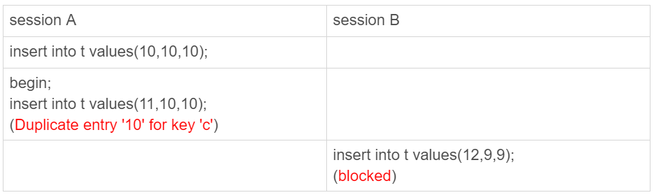

# 极客时间--MySQL实战45讲--第40讲：insert语句的锁为什么这么多？

某些特殊的select语句，在执行过程中会给其他资源加锁，或者无法再申请到自增id后立马释放自增锁

### insert...select语句
    CREATE TABLE `t` (
      `id` int(11) NOT NULL AUTO_INCREMENT,
      `c` int(11) DEFAULT NULL,
      `d` int(11) DEFAULT NULL,
      PRIMARY KEY (`id`),
      UNIQUE KEY `c` (`c`)
    ) ENGINE=InnoDB;

    insert into t values(null, 1,1);
    insert into t values(null, 2,2);
    insert into t values(null, 3,3);
    insert into t values(null, 4,4);

    create table t2 like t
 在可重复读的隔离级别下，bin_format=statement时执行：

    insert into t2(c,d) select c,d from t;
从日志和数据的一致性上考虑，会对表t的所有行和间隙加锁。
实际的执行效果是：如果session B先执行，由于这个语句对表t主键加了一个(-&，1]这个next-key lock，会在语句执行完后，才允许session A的insert语句执行

但如果没有加锁的话，就可能出现session B的insert语句先执行，但后写入binlog的情况。于是，在binlog_format=statement的情况下，binlog记录了：

    insert into t values(-1,-1,-1);
    insert into t2(c,d) select c,d from t;
这个语句到了备库执行，就会把id=-1这一行也写到表t2中，出现主备不一致

insert...select也不是锁住全表，而是只锁住需要访问的资源

### insert循环写入
有这么一条sql：

    insert into t2(c,d)  (select c+1, d from t force index(c) order by c desc limit 1);
这个锁的加锁范围是表t上的索引c (3,4],(4,supermum]这两个next-key lock以及主键索引上id=4这一行（从表t中按照索引c倒序，扫描第一行），因此正条语句的扫描行数是1

    insert into t(c,d)  (select c+1, d from t force index(c) order by c desc limit 1);
然而对于这条语句，扫描行的是5行，从explain的结果来看：
[insert...select的explain结果](../images/mysql实战45讲/insert...select的explain结果.png)

可以看到，这个语句使用了临时表，也就是在执行过程中，需要把表t的内容读出来，写入临时表，explain里的rows=1是因为受了limit1的影响，从另一个角度看InnoDB扫描了多少行

[查看InnoDB_rows的变化](../images/mysql实战45讲/查看InnoDB_rows的变化.png)

可以看到innodb_rows_read增加了4，因为默认临时表是使用Memory引擎，所以这4行查的都是表t，也就是对表t做了全表扫描，因此整个过程如下：
1. 创建临时表，表里有两个字段c和d
2. 按照索引c扫描表t，一次取c=4、3、2、1，然后回表，读到c和d的值写入临时表，这时rows_examined=4
3. 由于limit 1，索引只取临时表的第一行，在插入到表t中，这时Rows_examined的值加1，变成5

所以这条语句会对表t做全表扫描，并且会给索引c上的所有间隙都加上next-key lock。所以在这个事务执行期间，其他事务不能在这个表上插入数据。因为这类一边遍历数据，一边更新数据的情况，如果读出来的数据直接写回原表，就可能在遍历的过程中读到刚刚插入的记录，新插入的数据如果参与计算逻辑，就与语义不符

优化方式：

    create temporary table temp_t(c int,d int) engine=memory;
    insert into temp_t  (select c+1, d from t force index(c) order by c desc limit 1);
    insert into t select * from temp_t;
    drop table temp_t;
这样既有需要扫描一行数据

### insert唯一键冲突

session A执行的insert语句，发生唯一键冲突的时候，除了报错，还会在冲突的索引上加锁，由于一个next-key lock就是由他的右边界的值定义的，因此，session A持有索引c上的(5, 10]共享next-key lock(读锁)，这样可以避免这条数据被别的事务删除。

死锁产生的逻辑：
1. T1时刻，session A启动，在索引c=5上加了记录锁，这个锁是唯一索引，因此退化为记录锁
2. T2时刻，session B要执行相同的insert语句，发现唯一键冲突，加上读锁；同样的，session C也在索引c上，c=5这一个记录上，加上读锁
3. T3时刻，session A回滚，session B和session C都试图继续执行插入操作，都要加上写锁。两个session都要等待对方的行锁，索引就形成了死锁

### insert into...on duplicate key update
这个语句得了逻辑是：插入一行数据，如果碰到唯一键约束，就执行后面的更新语句，如果有多个列违反了唯一性约束，就会按照索引顺序，修改跟第一个索引冲突的行
上面这个例子是主键冲突报错，如果改写成：

    insert into t values(11,10,10) on duplicate key update d=100;
 会给索引c上(5， 10]加上排它锁（写锁）。

例如：在表中已经有了（1，1，1），（2，2，2）这两行，看这个操作：

执行这条语句的affected rows返回的是2，实际上，真正更新的只有一行，但在代码实现上，insert和update都认为自己成功了，update计数加了1，insert计数也加了1
